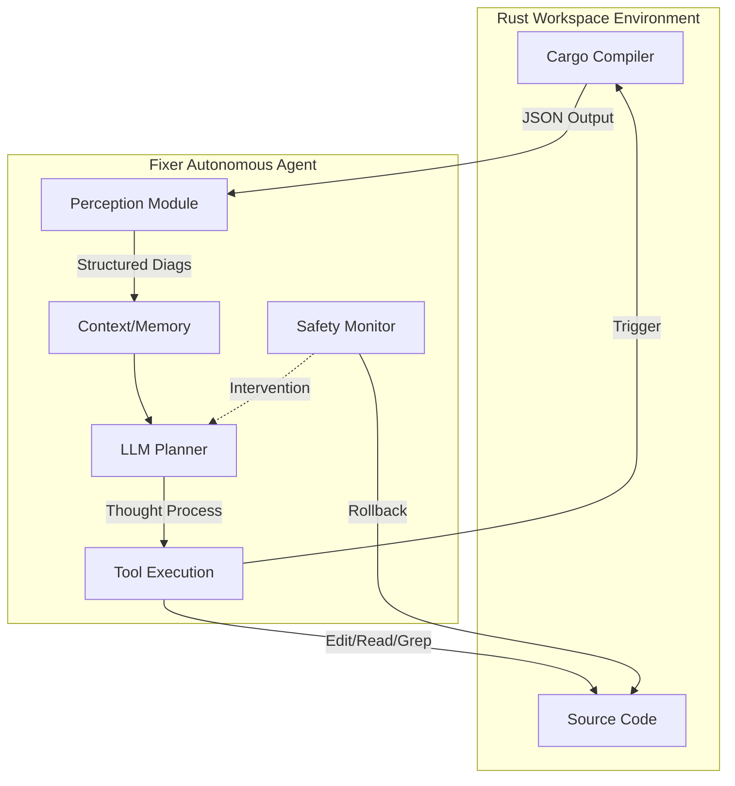

# Fixer 项目深度解析：智能自治的 Rust 修复 Agent

## 1. 项目定位：不仅仅是脚本，而是 Autonomous Agent

Fixer 不仅仅是一个简单的“编译器报错修复脚本”，它是一个设计精良的 **Autonomous Software Engineering Agent（自治软件工程智能体）**。

与传统的 Copilot 或基于规则的修复工具（如 `rustfix`）不同，Fixer 拥有**Agency（主体性）**。它不仅仅是响应用户的单次请求，而是拥有自己的：
1.  **长期记忆 (Long-term Memory)**：通过 `DiagnosticCache` 和 `FileContentCache` 记忆上下文。
2.  **自我反思 (Self-Reflection)**：通过 `DoomLoopTracker` 监控自己的行为，检测是否陷入死循环。
3.  **工具使用 (Tool Use)**：能够像人类工程师一样，主动决定何时 `Read` 文件，何时 `Grep` 搜索，何时 `Edit` 修改。
4.  **环境感知 (Environment Perception)**：通过解析结构化诊断信息（Structured Diagnostics）实时感知代码库的健康状态。

它是一个运行在本地的、专注于 C-to-Rust 迁移领域的 AI 工程师。

---

## 2. Agentic Workflow (智能体工作流)

Fixer 的核心不仅仅是循环，而是一个包含**感知 (Perceive)、决策 (Decide)、行动 (Act)、验证 (Verify)** 的完整认知闭环。

### 2.1 感知模块 (Perception)
Agent 不仅“看”到了错误，还能“理解”错误。
-   **结构化解析**：`src/repair.ts` 将 Cargo 的 JSON 流解析为 Agent 可理解的语义对象，去除了 90% 的噪声（如冗余的 Note）。
-   **按需聚焦**：通过 `summarizeErrorsByFile`，Agent 能够识别“热点文件”（Hotspots），优先处理错误最集中的区域，体现了**注意力机制 (Attention Mechanism)**。

### 2.2 决策与行动 (Decision & Action)
Agent 拥有类似于 ReAct (Reasoning + Acting) 的能力。
-   **Native Tool Use**：Agent 不是输出“修复后的文件”，而是输出“操作指令”。
    -   `Read`: 主动读取文件，支持 offset/limit，模拟人类浏览代码。
    -   `Edit`: 执行精确的字符串替换，模拟 IDE 编辑。
    -   `Grep/Glob`: 主动搜索代码库，解决跨文件引用问题（如“找不到定义”）。
-   **CoT (Chain of Thought)**：在 System Prompt 中植入了思维链，引导 Agent 先观察（Read）再行动（Edit），并强制验证（Verify）。

### 2.3 自我反思与纠错 (Self-Correction & Reflection)
它能意识到自己“做错了”或“卡住了”。
-   **Doom Loop Detection (`src/doom-loop.ts`)**：
    -   Agent 会记录自己的操作历史。
    -   如果发现自己连续多次（阈值为 3）对同一文件执行相同的无效操作，它会触发 `DoomLoop` 警报，强制中断或改变策略，避免陷入无限循环。
-   **Intelligent Retry (`src/retry.ts`)**：
    -   处理瞬态错误（如 API 超时、速率限制），使用指数退避策略（Exponential Backoff）。
-   **Regression-based Rollback (`src/safety/backup.ts`)**：
    -   Agent 维护着一个**“时间机器”**。每次迭代都会创建快照。
    -   如果 Agent 的修复导致错误数不降反升（Regress），Safety Monitor 会介入，强制将环境回滚到“最佳已知状态”（Best Known State），并清除错误的记忆。

---

## 3. 核心技术架构解析

### 3.1 状态管理 (`src/core-manager.ts`)
Fixer 使用 `CoreManager` 来维护 Agent 的生命周期。它是一个单例管理器，确保 Agent 在多次迭代中保持状态（Session）的连续性，同时又能高效地复用资源。

### 3.2 双层缓存系统 (`src/cache/`)
为了让 Agent 跑得更快且更省钱，Fixer 设计了双层缓存：
1.  **FileContentCache**: 内存级文件缓存，避免重复 I/O。只有当文件 `mtime` 变化时才重新读取。
2.  **DiagnosticSummaryCache**: 语义级缓存。如果编译器报出相同的错误组合，直接复用已生成的 Prompt 摘要，避免重复的文本处理开销。

### 3.3 混合智能策略 (Hybrid Intelligence)
Fixer 承认 LLM 并非万能，因此采用了 **Neuro-Symbolic（神经符号）** 系统的思路：
-   **Symbolic (符号派)**：`deterministic-fixes.ts` 使用正则表达式处理确定的语法模式（如 C 风格的 `struct` 关键字残留）。
-   **Neural (神经派)**：LLM 处理复杂的语义逻辑（如生命周期推断、借用检查）。
这种结合保证了系统的**鲁棒性**和**灵活性**。

---

## 4. 从 Rust 出发的通用方法论

Fixer 的设计哲学对其他 AI 辅助编程工具具有普适性：

### 4.1 编译器即强化学习环境 (Compiler as RL Environment)
Rust 编译器极其严格的检查机制，实际上构成了一个高质量的**Reward Model (奖励模型)**。
-   **方法论**：Agent 的每一次 Edit 都是一次 Action，Cargo Check 的结果就是 Environment Feedback。Fixer 本质上是在进行一次基于环境反馈的**强化学习 (Reinforcement Learning)** 过程，目标是最小化 `ErrorCount`。

### 4.2 最小特权与沙箱 (Least Privilege & Sandbox)
-   **方法论**：Agent 的能力必须被约束。Fixer 的 `CommandPolicy` 严格限制了 Agent 只能执行白名单内的命令（如 `cargo check`），禁止执行任意 Shell 命令，确保了运行时的安全性。

### 4.3 悲观执行与乐观回滚 (Pessimistic Execution, Optimistic Rollback)
-   **方法论**：在代码修复场景中，破坏往往比建设更容易。Fixer 的设计假设 Agent **一定会犯错**，因此将“回滚”作为一等公民（First-class Citizen）构建在核心循环中。这种“反脆弱”设计是 AI Agent 落地工程项目的关键。

---

## 5. 总结

Fixer 不仅仅是一个脚本，它展示了当我们将 LLM 赋予工具使用能力、记忆能力和反思能力，并将其置于严格的编译器约束环境中时，它能展现出惊人的工程解决能力。对于科研而言，Fixer 提供了一个极佳的 **Agentic Software Engineering (ASE)** 研究样本。
